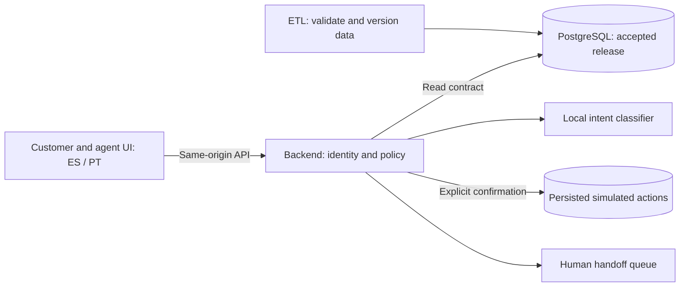

# Waqi'wuqu — Factored AI & Data Hackathon 2026

Spanish and Portuguese card-support demo: a traceable ETL, an authenticated backend
with a local intent classifier, and a customer/agent interface. Customer actions are
simulated, require explicit confirmation, and are verified against persisted evidence.
Human escalation has separate queued, assigned, accepted, and resolved states.

## Submission links

| Deliverable | Link / status |
| --- | --- |
| ETL source | [FactoredAI_base](https://github.com/yehosuah/FactoredAI_base) — public |
| Backend source | [FactoredAI_BCK](https://github.com/yehosuah/FactoredAI_BCK) — public |
| Frontend source | [FactoredAI_FRT](https://github.com/yehosuah/FactoredAI_FRT) — **private; judges cannot clone it without access** |
| Working deployment | Pending URL from the deployment owner |
| Presentation, 4–6 slides | Pending link |
| Demo video, at most 3 minutes | Pending link |

The frontend remains private while permission to redistribute organizer PDFs in its
Git history is checked. This hub contains no organizer PDFs, bank datasets, credentials,
or customer records. The submission is incomplete until the pending links and frontend
source access are resolved.

## Architecture

ETL publication preserves history and records provenance; the backend consumes an
accepted release and keeps simulator state separately. Classifier text is not action
evidence. Receipts and stored state determine whether a simulated action succeeded.
The local classifier is an intent model, not an LLM. No real bank or payment system
is connected by the synthetic demo.

## Review and reproduce

- [Source and local setup](docs/setup.md): public component checks and the synthetic demo entry point.
- [Validation evidence and limits](docs/evidence.md): exact revisions, regression results, and unpublished dependencies.
- [ETL runtime guide](https://github.com/yehosuah/FactoredAI_base/blob/main/docs/demo-runtime.md).
- [System evaluation contract](https://github.com/yehosuah/FactoredAI_base/blob/main/docs/system-evaluation.md).

The reported integrated regression used a **local, unpublished backend candidate**.
It cannot be reproduced by cloning backend `main`. Public backend `main` is a different
revision and needs its own integrated validation. This hub does not publish that candidate.
