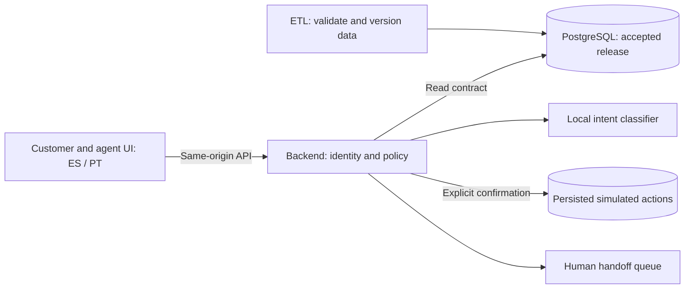

# Waqi'wuqu — Factored AI & Data Hackathon 2026

Spanish and Portuguese card-support demo: a traceable ETL, an authenticated backend
with a local intent classifier, and a customer/agent interface. Customer actions are
simulated, require explicit confirmation, and are verified against persisted evidence.
Human escalation has separate queued, assigned, accepted, and resolved states.

## Source in this repository

One clone includes the actual component code, tests, dependency locks, build files,
and documentation:

| Directory | Source revision | Files |
| --- | --- | ---: |
| [etl/](etl/) | `c222173ee03df46be914cbfacfb097823f6a7196` | 114 |
| [backend/](backend/) | `1e0321dc2c01ad5b4834183466b43f4563be18e4` | 100 |
| [frontend/](frontend/) | `24d08564c7e20da18e12b4563cdf36a494143f1d` | 43 |

[source-manifest.json](source-manifest.json) records upstream repositories, exact
remote `main` commits, Git author attribution, file hashes, modes, and exclusions.
Component files retain their original bytes. There are no nested Git repositories
or submodules. Run `make verify-sources` to check the snapshots.

```sh
git clone https://github.com/yehosuah/factored-hackathon-2026-waqi-wuqu.git
cd factored-hackathon-2026-waqi-wuqu
make setup
make check
```

See [root setup instructions](docs/setup.md) for prerequisites, database tests,
the synthetic runtime, and frontend startup.

## Submission links

| Deliverable | Link / status |
| --- | --- |
| ETL source | [Included here](etl/); [original repository](https://github.com/yehosuah/FactoredAI_base) |
| Backend source | [Included here](backend/); [original repository](https://github.com/yehosuah/FactoredAI_BCK) |
| Frontend source | [Included here](frontend/); original `FactoredAI_FRT` remains private |
| Working deployment | Pending URL from the deployment owner |
| Presentation, 4–6 slides | Pending link |
| Demo video, at most 3 minutes | Pending link |

The original frontend repository remains private while permission to redistribute
organizer PDFs in its Git history is checked. Its code is publicly cloneable here
without those PDFs or that history. This repository excludes organizer material,
private work notes, credentials, generated runtime state, and organizer datasets.
The backend's team-authored synthetic classifier corpus is included. The deployment,
presentation, and video links remain pending.

## Architecture



ETL publication preserves history and records provenance; the backend consumes an
accepted release and keeps simulator state separately. Classifier text is not action
evidence. Receipts and stored state determine whether a simulated action succeeded.
The local classifier is an intent model, not an LLM. No real bank or payment system
is connected by the synthetic demo.

## Review and reproduce

- [Source and local setup](docs/setup.md): consolidated component checks and the synthetic demo entry point.
- [Validation evidence and limits](docs/evidence.md): exact revisions, regression results, and unpublished dependencies.
- [ETL runtime guide](https://github.com/yehosuah/FactoredAI_base/blob/main/docs/demo-runtime.md).
- [System evaluation contract](https://github.com/yehosuah/FactoredAI_base/blob/main/docs/system-evaluation.md).

The reported integrated regression used a **local, unpublished backend candidate**.
It cannot be reproduced by cloning backend `main`. Public backend `main` is a different
revision and needs its own integrated validation. This hub does not publish that candidate.
