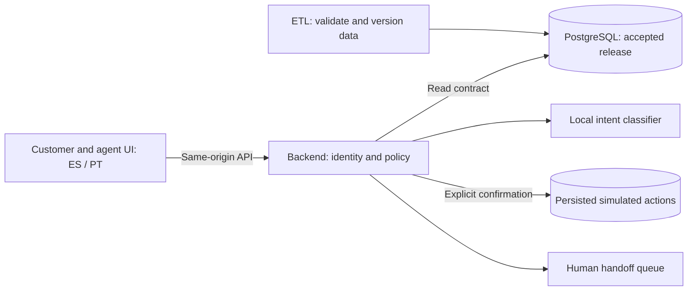

# Waqi'wuqu — Factored AI & Data Hackathon 2026

Waqi'wuqu is an AI-first banking customer-support prototype built for the **Factored AI & Data Hackathon 2026**.

The system provides authenticated card support in **Spanish and Portuguese**, combines a local intent classifier with deterministic banking tools, requires explicit confirmation before sensitive actions, verifies outcomes against persisted evidence, and escalates customers to a human agent when automation is not appropriate.

## Live Demo

**Application:**  
https://factored-ai.163-192-145-116.sslip.io/

### Public Demo Credentials

#### Customer

- Username: `demo`
- Password: `Mp3DT6H9ZuF8Q41H2ldF5MSUJ1VrJPPWmjtNmDOD-wY`

#### Human Agent

- Username: `demo-agent`
- Password: `oqR3IQku_Mv7EpJ465KSbNHA8zR9orWyW4lFmCjdVto`

These credentials provide access only to the synthetic hackathon demo environment.  
No real customer, banking, payment, or production data is used.

## What the Demo Supports

The customer experience includes:

- Authenticated customer sessions
- Card and movement consultation
- Spanish and Portuguese support conversations
- Local intent classification
- Explicit card selection and context
- Simulated card actions
- Separate confirmation before sensitive actions
- Verified execution receipts
- Unrecognized-charge workflows
- Explicit human escalation from the chat
- Persistent conversations and handoffs across reconnects

The human-agent experience includes:

- Independent agent authentication
- Assigned customer handoffs
- Case acceptance
- Case resolution
- Persisted handoff state visible to the customer

The demo never performs real banking operations. Card actions and case handling operate only against team-generated synthetic data.

## Safety and Control Model

The model does not directly execute banking actions.

Instead, the application separates language understanding from deterministic execution:

1. The local classifier interprets the customer request.
2. The backend validates authenticated customer and card context.
3. Read-only tools retrieve permitted information.
4. Mutating actions create a pending server-owned confirmation.
5. The customer must explicitly confirm the action separately.
6. The backend revalidates authorization and state before execution.
7. Only persisted execution evidence produces a verified receipt.
8. Unsupported, ambiguous, or human-requested cases are escalated instead of guessed.

Explicit requests for a human agent use a deterministic handoff API and do not depend on intent classification.
## Source in this repository

One clone includes the actual component code, tests, dependency locks, build files,
and documentation:

| Directory | Source revision | Files |
| --- | --- | ---: |
| [etl/](etl/) | `c222173ee03df46be914cbfacfb097823f6a7196` | 114 |
| [backend/](backend/) | `1e0321dc2c01ad5b4834183466b43f4563be18e4` | 100 |
| [frontend/](frontend/) | `15c50c903073a437ec7af3130311a9dec33c1605` | 43 |

[source-manifest.json](source-manifest.json) records upstream repositories, exact
remote `main` commits, Git author attribution, file hashes, modes, and exclusions.
Component files retain their original bytes. There are no nested Git repositories
or submodules. Run `make verify-sources` to check the snapshots.

```sh
git clone https://github.com/yehosuah/factored-hackathon-2026-waqi-wuqu.git
cd factored-hackathon-2026-waqi-wuqu
make setup
make check
```

See [root setup instructions](docs/setup.md) for prerequisites, database tests,
the synthetic runtime, and frontend startup.

## Submission Links

| Deliverable | Link / status |
| --- | --- |
| Public repository | [factored-hackathon-2026-waqi-wuqu](https://github.com/yehosuah/factored-hackathon-2026-waqi-wuqu) |
| Working deployment | [Waqi'wuqu Live Demo](https://factored-ai.163-192-145-116.sslip.io/) |
| Presentation, 4–6 slides | Included with the hackathon submission |
| Demo video, under 3 minutes | [YouTube](https://youtube.com/watch?v=WtR6R8uWQwY&feature=youtu.be) |

The public repository excludes organizer datasets, private work notes, administrative credentials, generated runtime state, and deployment secrets.

The live application uses only team-generated synthetic banking data and simulated banking actions.

The original frontend repository remains private while permission to redistribute
organizer PDFs in its Git history is checked. Its code is publicly cloneable here
without those PDFs or that history. This repository excludes organizer material,
private work notes, credentials, generated runtime state, and organizer datasets.
The backend's team-authored synthetic classifier corpus is included. The deployment
link was supplied by its owner; presentation and public video links remain pending. See
[known compatibility limitations](docs/evidence.md#known-integration-blocker).

## Architecture



ETL publication preserves history and records provenance; the backend consumes an
accepted release and keeps simulator state separately. Classifier text is not action
evidence. Receipts and stored state determine whether a simulated action succeeded.
The local classifier is an intent model, not an LLM. No real bank or payment system
is connected by the synthetic demo.

## Review and reproduce

- [Source and local setup](docs/setup.md): consolidated component checks and the synthetic demo entry point.
- [Validation evidence and limits](docs/evidence.md): exact revisions, regression results, and unpublished dependencies.
- [ETL runtime guide](https://github.com/yehosuah/FactoredAI_base/blob/main/docs/demo-runtime.md).
- [System evaluation contract](https://github.com/yehosuah/FactoredAI_base/blob/main/docs/system-evaluation.md).
