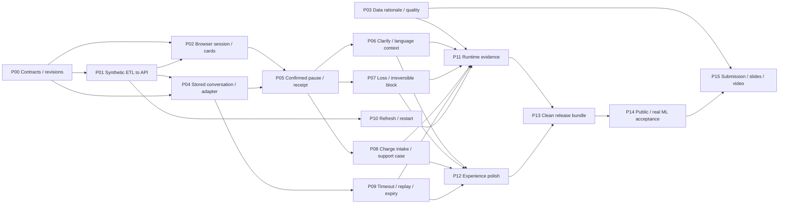

# Agent sprint: October 3-5, 2026

**Current readiness update (2026-10-04):** Read [readiness and Andrew's next task](readiness-update-2026-10-04.md). It supersedes the implementation/status snapshot below: backend latest `142608b`, local combined safety fixes pass 269 tests, ETL fixes pass 196 tests plus isolated Linux/PostgreSQL checks, and R1 is reserved for Andrew. No full sprint gate is accepted. Frontend remains excluded from this execution pass.

Status: proposed execution plan. Existing main and candidate-branch implementations are distinguished below; no work packet is accepted solely from branch presence.
Dates use America/Guatemala. October 5 is the requested sprint horizon, not a verified organizer submission deadline.

## Outcome and scope

A judge can open the deployed application, enter an isolated synthetic test session, and complete a card-support conversation in Spanish or Portuguese. The application asks for missing information, obtains explicit confirmation for mutations, executes an authorized simulated tool, verifies its result, and presents a useful support case when escalation is required. A fresh clone can reproduce the demo and its engineering acceptance evidence.

This sprint covers **ETL, backend, and frontend**. Model selection, training, prompts, intent classification, retrieval algorithms, annotation, translation certification of ML datasets, model tuning, and model benchmarking are outside this sprint. Backend integration with the ML team's delivered interface is in scope. Engineering tests of that interface and its failures are in scope.

All work gates below are agent-verifiable. They do not depend on meetings, human estimates, story points, or scheduled review ceremonies. Hosting access, permitted data use, spending authorization, the team name, and a real compatible ML delivery are external prerequisites; agents cannot manufacture them. The deployment architecture is provider-neutral, as requested.

## What exists, and what is missing

The audit used local source and the original problem statement and kickoff PDFs, not the presence of a README alone. The [aggregate audit record](audit-2026-10-03.json) preserves source revisions, table reconciliation, the SQL behind the attribution findings and check results without individual records.

| Area | Evidence observed on October 3 | Gap to close |
| --- | --- | --- |
| ETL | Nine-table extraction, typed transformation, quarantine, immutable Parquet, transactional PostgreSQL publication, scheduling and recovery are implemented. Accepted release has 6,020,768 rows; 93,261 of 6,114,029 inputs are quarantined. | Reproducible public synthetic boot, usable quality/freshness evidence, card-workflow rationale, and CI that does not depend on private local files. |
| Backend | FastAPI supports opaque sessions, customer-scoped reads, masked numbers, persistent simulated card actions, eligibility checks, transactional idempotency and action auditing. | Conversation lifecycle, ML adapter, server-side confirmation, complete case handoff, conversation traces, stable domain errors and public-demo isolation. |
| Frontend | React/TypeScript/Vite starter has ES/PT copy and a language selector. | Authentication, card context, chat, clarification, confirmation, verified receipts, handoff, failure states and API integration. |
| ML dependency | ETL delivers an exploration pack: 16 policies, 72 intent cases, 20 retrieval cases and 16 handoff cases. Labels are drafts; splits are unset. No ML runtime is integrated in these checkouts. | ML team supplies a compatible runtime and its own baseline/held-out evidence. Do not convert this into ML work in this sprint. |
| Operation | October 1 evidence documents real ETL/BCK publication, rollback, customer isolation, concurrency and restart checks. | Re-run acceptance on the final integrated build and deploy an externally reachable demo. At audit time Compose had no running services and port 8000 did not respond. |
| Submission | Requirements exist in the local briefs. | Public submission repository, deployment link, 4-6 slides, mandatory short demonstration video and a coherent evidence index. |

Checks run during this audit:

- ETL `make check` passed; `make test` passed 207 collected cases. Five byte-identical `* 2.py` test copies account for 100 cases; the canonical suite collects **107**, not 207 independent tests.
- Backend `make check` passed, including **22** tests, in its own environment.
- Frontend `npm ci --offline --no-audit --no-fund` and `npm run check` passed. This establishes a buildable starter, not a working service flow.
- Thirty tracked runtime/test/lock files compared between the workspace ETL and `FactoredAI_base` are byte-identical. They are separate checkouts of the same ETL, not two pipeline modules.
- Real PostgreSQL/restart results in the October 1 verification record are historical evidence; this audit did not restart services or claim a new live end-to-end pass.

Specific findings that change the sprint:

1. **The current demo cannot exercise a complete unknown-charge flow.** Default fixtures create cards and states, but no movements. Movement reads and charge registration use `bank.transactions`. The existing verification script exercises disputes with an organizer-backed test account.
2. **A fresh clone lacks local prerequisites.** Organizer data, the accepted raw release and ML draft files are ignored. The transform library allows no ML pack, but the CLI defaults to a private local ML-pack path. Public-demo boot must explicitly handle this without changing ML content or readiness claims.
3. **Handoff is incomplete.** `/me/handoff` returns the customer's latest committed action results. It does not capture a conversation's request, unresolved questions, failed attempts or reason for escalation, and it is not a support queue.
4. **Data attribution has a serious limitation.** The accepted interactions contain 536,046 comma-separated product-mention tokens. Exact joins find 3,475 products, including 1,197 card products, but zero matched mentions also have the interaction customer's ownership. This is a failure of that attribution method, not evidence of zero card demand. Do not use it to authorize access or count card-support calls.
5. **Quarantine affects analytics.** Complaints lose 44,878 of 67,095 input rows (**66.9%**). Transcripts lose 27,469 of 171,321 (**16.0%**). Almost all customer branch references remain explicitly unresolved. Retained-only complaint or branch statistics can be misleading.
6. **Broad contact reasons are insufficient routing labels.** The 670,427 accepted interactions have six broad categories; `Producto` and `Transaccional` do not mean card support. There are 140,040 accepted card products across 91,084 customers, but product prevalence does not establish support-call incidence.
7. **Documentation is stale in places.** The brief and evaluation README still describe some implemented work as pending. Agents must use current code, contracts and verification records as their implementation baseline.

Relevant sources:

- [Original problem statement](https://github.com/yehosuah/FactoredAI_FRT/blob/95a1a43463fc3ceae007e4d36c9d3c9ce1432dab/GeneralInfo/Factored%20AI%20%26%20Data%20Hackathon%202026%20%281%29.pdf), pp. 2-6: focused flow, ES/PT, normal/ambiguous/human-required routes, verified tools, permissions, learned-component comparison, held-out failures and operational evidence.
- [Original kickoff](https://github.com/yehosuah/FactoredAI_FRT/blob/95a1a43463fc3ceae007e4d36c9d3c9ce1432dab/GeneralInfo/Datathon_2026_Kickoff%20%281%29.pdf), pp. 10-15, 18 and 20: working system and submission artifacts. No numerical judging weights are assumed.
- [Accepted ETL/BCK contract](https://github.com/yehosuah/FactoredAI_base/blob/dbb32f5/docs/design/etl-system/contract.md), [October 1 verification](https://github.com/yehosuah/FactoredAI_base/blob/dbb32f5/docs/design/etl-system/verification.md), [runbook](https://github.com/yehosuah/FactoredAI_base/blob/dbb32f5/docs/etl-operations.md), [ML review state](https://github.com/yehosuah/FactoredAI_base/blob/dbb32f5/docs/design/ml-handoff/review.md).
- Backend source: `routes.py`, `store.py`, `security.py`, its own README and ADR 0001. Frontend source: `App.tsx`, `i18n.ts`, its own README and `docs/reto.md`.

## Remote branch review: reuse before implementation

The [GitHub review](github-review-2026-10-03.md), checked through `yehosuah`, supersedes any inference that the initial local checkouts represent all work in progress. There are zero open PRs in ETL/BCK/FRT. ETL PR #2 and BCK PR #1 are already merged. Candidate ETL `de0d3ea` adds a working aggregate profiler, optional ML packaging and auxiliary-file hardening. Candidate BCK `fd40d2c` includes the entire observability -> backend-tools -> human-handoff-routing chain. FRT remains `95a1a43` with no additional branch.

ETL checks and 187 tests passed; its profiler ran successfully against the accepted release. The latest BCK passed 215 tests with disposable PostgreSQL. Additional probes reproduced **R1** accepted-case recovery after account disablement, **R2** terminal-case queue ordering and **R3** contradictory action receipts marked verified. Fix these before final integration. Handoff grants/preflight are separate deployment prerequisites; the current integrated boot has not been updated to apply them.

Revise dispatch without adding a second implementation of existing work:

- **P00:** pin accepted main and candidate revisions separately, carry R1-R3 into owned BCK work, and specify handoff grants/readiness and the confirmation/conversation contracts.
- **P01:** reuse optional ML packaging; still implement complete synthetic ETL boot, movements, source-aware provenance, isolated visitor state and support-account provisioning.
- **P03:** reuse the profiler and its accepted-release output; finish workflow rationale, quality/attribution limits and freshness evidence. It measures 1,547,408 ownership-consistent card transaction rows and 77,712 recorded declines, which do not establish support demand or financial benefit.
- **P04/P05/P09:** reuse ToolDispatcher, correct receipt-state validation and add persistent conversations, delivered ML adapter, server-owned confirmation and unknown-outcome reconciliation.
- **P08/P10:** extend existing cases with conversation/attempt references, authorized recovery, active/manual queues, support UI and release/restart continuity.
- **P11/P13:** reuse process-local metrics but add end-to-end timing, attempted-failure evidence and CI that cannot silently skip database acceptance.

The profiler also shows 42 exact customer texts and 546 exact full texts in 143,852 accepted transcript rows. Keep this aggregate quality limitation visible; do not label row count as independent conversational evidence. No model implementation or evaluation work is added to this sprint.

The full review contains immutable code links, inventory, severity, reproductions, validation conditions and merge recommendations. The original local audit remains a historical snapshot; the new [remote review JSON](github-review-2026-10-03.json) records the branch evidence independently. No packet is marked complete yet.

## Product strategy

The flagship demonstration is one coherent card-support journey with three routes:

1. **Normal:** identify an owned active card, confirm a temporary pause, execute once, show the verified PAUSED state, and optionally reactivate it.
2. **Ambiguous:** receive “block my card” / “bloqueie meu cartão,” clarify temporary pause versus loss/theft and select the correct owned card before showing any action confirmation.
3. **Human-required:** select an owned historical or team-synthetic transaction, register an unrecognized-charge request, and create a structured support case. State that review was requested; do not claim a refund or fraud adjudication.

Also prove loss/theft blocking cannot be automatically reversed. Keep activation and replacement available only if they meet the same acceptance standard; they are secondary polish rather than prerequisites for the three flagship routes.

Make elegance visible through one consistent interaction: card context, a conversation, and concise result/case panels. Clearly separate “needs your confirmation,” “result verified,” “request registered,” and “transferred to the support queue.” Show source dates and simulation provenance near the relevant values. Demonstrate explanations from policy versions, source references and execution receipts.

The strongest differentiator available in this codebase is trustworthy action execution backed by a reproducible data release. Broadening to lending, payments or other banking workflows does not solve the current gaps and has no automatic judging bonus.

## Repository ownership and concurrency

| Boundary | Working location | Ownership |
| --- | --- | --- |
| ETL | [FactoredAI_base](https://github.com/yehosuah/FactoredAI_base) | Pipeline, fixtures, release contract, quality/freshness aggregates, integrated runtime packaging. Use one canonical checkout per packet. |
| Alternate ETL checkout | Any second clone of `FactoredAI_base` | Same ETL project. Pin one checkout for each work packet; never apply the same change to both. |
| Backend | [FactoredAI_BCK](https://github.com/yehosuah/FactoredAI_BCK) | Sessions, conversations, authorized tools, confirmations, verified receipts, cases and ML interface adapter. Independent Git/environment/checks. |
| Frontend | [FactoredAI_FRT](https://github.com/yehosuah/FactoredAI_FRT) | React customer experience, translation copy, typed client, browser checks. Use the inner Git repository. |
| ML | External team's delivery | Runtime and ML evidence. Consume its interface; do not implement its internals. |

Use an integration owner plus up to three active worker agents when this environment's four-agent limit applies. With separate chats, keep the same work-in-progress cap as an organizational rule. Role names are ownership labels, not a request to spawn chats now.

- **Integration owner:** pins revisions, maintains the contract and dependency board, selects ready packets, integrates changes serially, owns the shared acceptance stack and release evidence.
- **Data/runtime worker:** ETL boot, quality report, freshness and reproducible release packaging.
- **Service worker:** backend lifecycle, tools, confirmation, adapter and handoff.
- **Experience worker:** frontend integration and user-facing behavior; later rotates into independent browser QA.

Each packet has one owner, even when it spans repositories. A packet may request a bounded contribution from another worker, but two workers must not edit the same files or run mutating tests against the same database concurrently. Use isolated worktrees and temporary fixture databases. Only the integration owner runs release/restart checks against the shared stack.

Every handoff includes repository/branch and commit IDs, contract version, behavior demonstrated, exact commands and results, fixture provenance, remaining blockers and affected consumers. Use the `yehosuah/` branch prefix. Preserve existing untracked work and duplicate files until compared; do not clean the workspace by bulk deletion.

Keep implementation tickets and decisions in each repository's configured local issue area. This document is a cross-repository proposed plan, not a publication of issues or a modification of existing completed tickets. Put shared integration dependencies in the plan's board and reference their IDs from repository-local tickets when execution begins.

## Gates and calendar anchors

The dates organize release checkpoints. They are not task-duration estimates. A gate passes only on evidence; a calendar change never overrides an unmet dependency.

| Anchor | Gate | Observable exit condition |
| --- | --- | --- |
| October 3 | G0: reproducible foundation | P00-P03 complete: pinned repositories, executable contracts, public synthetic ETL/BCK boot, real browser login/card reads, traceable data rationale. |
| October 3 onward | G1: first complete journey | P04-P05 complete: a stored conversation can confirm and execute a pause once and show its verified result in the browser. Stub versus real ML mode is explicit. |
| October 4 | G2: complete behavior | P06-P09 complete: clarification, loss/theft, transaction review and structured escalation, plus timeout/replay/expiry behavior, pass in ES and PT. |
| October 4 onward | G3: operation and polish | P10-P12 complete: corrected-release/restart acceptance, measured runtime evidence, polished browser experience and evidence ready for P13 release packaging. |
| October 5 | G4: judges' release | P13-P15 complete: reachable TLS demo, real ML integration acceptance, final public package, slides and working video validated against the frozen revisions. |

Foundation and independent analysis run concurrently. P00 includes frontend consumer examples against the executable contract; the complete browser packet starts after synthetic boot passes. Documentation and submission structure can be prepared early; claimed results, screenshots and video must come from the accepted build.

## Agent work packets

P00-P11 and P13-P15 are required. P12's accessibility and coherent failure presentation are required; decorative additions are optional. P07's loss/theft behavior is required because the existing simulator supports it and confusing it with temporary pause is material.

| ID | Owner; repositories | Blocked by | Demonstrable result |
| --- | --- | --- | --- |
| P00 | Integration; BCK + contract mirror in FRT/ETL | Nothing | Pinned versions and an executable consumer contract exercise success, clarification, confirmation, escalation and invalid ML responses with a labeled stub. Existing HTTP tools remain compatible. |
| P01 | Data/runtime; ETL + BCK | P00 | A new empty demo database ingests a versioned team-generated nine-table fixture through Extract/Transform/Load and serves owned cards and movements through authenticated BCK endpoints. No organizer files, AWS access or private ML pack are needed. |
| P02 | Experience; FRT + BCK | P00, P01 | Browser enters a bounded, isolated trusted test session, shows its cards/movements and source date, and handles missing release, expiry and logout. Two visitors cannot modify each other's demo state. |
| P03 | Data/runtime; ETL | Nothing | Reproducible aggregate report explains workflow choice, population/coverage, quarantine and attribution limitations, using a pinned organizer release locally and no individual records in the public output. |
| P04 | Service; BCK | P00, P01 | Authenticated conversation creation/turns persist across reconnect, enforce ownership, call an injected ML adapter, validate structured outputs and correlate turn/tool/evidence IDs. A stub-backed HTTP demonstration verifies the interface. |
| P05 | Service/experience packet owner; BCK + FRT | P02, P04 | User requests a pause, confirms the exact card/action, and sees a verified receipt and refreshed state. Duplicate submission causes one effect. Cancel, changed selection and stale confirmation do not execute. |
| P06 | Experience packet owner; FRT + BCK | P05 | Ambiguous requests stop before action; card selection and pause/loss clarification continue the same conversation. ES/PT language changes preserve context and do not change an already confirmed action's meaning. |
| P07 | Service packet owner; BCK + FRT | P05 | Explicit loss/theft confirmation blocks an owned card and displays a verified BLOCKED result; attempted automatic reactivation is refused with a useful next step. Multiple requested actions cannot bypass priority or eligibility. |
| P08 | Service/experience packet owner; BCK + FRT | P05, P01 | User selects a fixture movement, registers human review, and opens a conversation-scoped support case with request, verified facts, actions/attempts, evidence and unresolved questions. Restricted demo support view can inspect it. |
| P09 | Service; BCK + FRT | P04; P05 for action checks | ML/tool timeout, malformed provider response, lost HTTP response, expiry and retry are reproducible. UI distinguishes failure from unknown outcome and obtains the committed receipt before asserting success. No automatic mutation from fallback. |
| P10 | Data/runtime; ETL + BCK | P01 | Controlled correction and partial-load failure keep readers on a complete release; repeat and restart preserve existing simulator state and action receipts. Source cutoff stays historical while pipeline execution time changes. |
| P11 | Independent acceptance worker; all three | P03, P06-P10 | Automated browser/API/Compose engineering suite emits a versioned results bundle, failure evidence, latency distributions and capacity observations without source rows or secrets. |
| P12 | Experience; FRT | P06-P09 | Final UI makes context, confirmation, receipts and support cases legible on desktop/mobile; keyboard, focus, contrast and all ES/PT states pass browser inspection. |
| P13 | Integration/runtime; all three | P11, P12 | Empty-directory clone/build/boot works from pinned independent repos with public synthetic fixtures, CI checks and a release manifest; no private workspace paths are required. |
| P14 | Integration; all three | P13, hosting access, compatible real ML delivery | Externally reachable TLS deployment passes the three ES/PT routes with the real delivered ML interface and isolated demo identities. Missing ML or hosting remains an explicit blocker, not a passed gate. |
| P15 | Integration/documentation; public submission package | P03, P14, ML team's evidence, team identity | Required repository link, deployment link, 4-6 slide presentation and short demonstration video match the accepted build and accurately separate engineering evidence from ML evidence and projected business impact. |

### Acceptance details for the critical packets

**P00 - Small interfaces, explicit authority.** Use IMPROGRESS Desarrollo's module-design guidance: one injected ML interface with a real adapter and a labeled stub; one authorized workflow interface around existing tools. Freeze request/response schemas and representative fixtures before consumers diverge. Define conversation and turn IDs, ES/PT language, minimal allowed context, intent/action proposals, clarification data, evidence references, provider version, errors and deadline behavior. Include proposed customer HTTP contracts for turns, confirmation, receipts and support cases. These are new proposed contracts, not currently implemented routes. The model cannot supply the trusted principal, grants, eligibility, action success or refund/issuance authority. No direct access from the browser to model credentials or private databases.

**P01 - Real data path for the public demo.** Preserve all nine-table grains, original fixture CSVs, checksums and release reconciliation. Include an active card and eligible/blocked states, owned movements with transaction ID + process date, a second isolated customer, missing optional amounts and a correction fixture. Emit explicit team provenance. Backend reads from `bank.products` currently hardcode organizer provenance; derive the correct provenance from the release manifest for fixture releases. Add an explicit CLI/demo setting to omit the optional ML review pack while preserving existing historical-pack behavior. Do not silently fabricate a missing organizer release or fall back from organizer mode to fixture mode.

**P02 - Isolated test identity.** Keep identity established by the trusted backend; a typed customer ID is never authentication. Public “try demo” sessions, if enabled, are restricted to bounded team fixtures with separate customer/card state, expiry and cleanup. Organizer-account provisioning stays private/administrative. Clear conversation and card data on logout or identity change. Prefer a same-origin `/api` proxy; document development proxy and production routing explicitly rather than relying on absent CORS behavior. Keep tokens out of URLs, logs and public bundles.

**P04/P05 - Action authority.** The backend stores a pending action bound to principal, conversation, card, parameters, policy version, expiry and relevant eligibility/state. Confirmation references that pending action; it is not an arbitrary browser or ML boolean. Revalidate before execution. Reuse existing transactional ownership/idempotency rules. Keep the same idempotency identity across retry of one confirmed command and reject conflicting reuse. Verified receipts use committed tool evidence. A server-owned typed receipt, not free-form model prose, establishes account facts or action completion.

**P08 - A real support case within a simulated bank.** Preserve actual conversation scope rather than aggregating a customer's last 20 unrelated actions. Separate verified facts, requested actions, failed/unknown attempts, committed outcomes and unanswered questions. Include policy/source/execution references, provenance, creation time and status. Require a support role for queue access; customer sessions can see only their own case. The queue is a prototype for handoff; it does not demonstrate a real employee accepted or resolved a case. Do not require an external CRM or send messages to people.

**P09 - Bounded failures.** Define adapter/tool deadlines and a bounded retry policy. Retry transient reads/provider calls only within their budget. Mutating retries keep the original command identity and reconcile receipts; they never create a new business command automatically. A timeout after commit produces an unknown client outcome until reconciliation, not a false “failed” or “completed” claim. Auth expiry revokes further access; a stale confirmation requires reauthentication and revalidation. Test hostile instructions at the engineering interface: another customer's IDs, fabricated evidence, unsupported tools and unauthorized action proposals must fail regardless of model output. This is service-boundary testing, not an ML prompt-injection benchmark.

**P10 - Historical truth and refresh correctness.** Preserve the accepted ADRs: immutable releases, transactional pointer, separate simulator state, branch-quality flags and optional money. Do not weaken ownership checks to improve acceptance counts. Show event/process/source cutoff separately from publication and scheduler-run time. A recent offline job is not fresh banking data. Live S3 remains deferred and is not required for the demo; labeled correction fixtures establish update behavior, as allowed by the problem statement.

**P11 - Evidence rather than checkmarks.** Cover the three routes in both languages, customer and conversation isolation, stale confirmations, idempotent races, malformed ML replies, expired sessions, missing data, tool timeout, partial publication and restart. Verify stored conversations, cases and receipts survive restart. Compare frontend state with authoritative API/DB receipts; assert absence of forbidden effects. Capture observed workload, sample size, warm/cold conditions, concurrency and end-to-end p50/p95, plus backend/DB timings. Publish observed values rather than inventing organizer thresholds. The internal gate is zero observed unauthorized effects, false action completions or false refund/issuance claims in the declared engineering suite, with counts and denominators; passing does not establish zero general risk. Record unresolved failures. ML correctness, learned-component comparisons and scored held-out evaluation stay with the ML team.

## How agents take work

1. The integration owner pins a base commit and contract version and chooses a packet whose dependencies passed. P00 and P03 can start immediately, reusing the candidate branches documented in the remote review. After P00, start P01 while P03 continues if needed. After P01, P02, P04 and P10 form a useful three-worker frontier with separate frontend, conversation and pipeline ownership.
2. A worker claims one packet and one isolated branch/worktree. Read that repository's AGENTS, README, glossary, ADRs and relevant contracts. ETL uses its own `uv`/Python 3.13 environment; backend uses its own `uv`/FastAPI environment; frontend uses its Node 24/npm lockfile.
3. Implement the smallest complete demonstrated behavior. Validate at the external interface, using existing fixture/HTTP/browser seams. Do not treat an unimplemented dependent layer as complete because a function unit test passes.
4. An independent worker verifies the handoff evidence and integration owner incorporates it serially. Resolve contract changes before letting affected consumers proceed.
5. Update packet state and release evidence. Stop/reassign a blocked packet to useful ready work; never fill its dependency with an unlabeled fake and mark the gate passed.

Suggested kickoff for a worker:

> Implement packet `<ID>` from this sprint plan in its listed repository or repositories. Read their instructions and accepted contracts first. Own only this packet's agreed files and use isolated fixtures/state. Do not work on ML algorithms, prompts, labels, training or model evaluation. Demonstrate the specified external behavior, run the repository's required checks and affected integration checks, and hand back commit IDs, contract version, commands/results, evidence and blockers. Do not publish data or spend money. Coordinate interface changes with the integration owner before modifying consumers.

Suggested kickoff for independent acceptance:

> Verify the candidate release against this plan's gate using public team fixtures and the pinned revisions. Exercise the browser, backend and ETL as a customer would; check authoritative state and absence of unauthorized effects. Keep real ML integration and stub mode distinct. Report each failure with reproduction and affected gate. Do not edit ML internals or waive acceptance requirements. Only the integration owner mutates the shared release stack.

## Provider-neutral deployment and release

Recommended initial architecture: one approved Linux host running the existing separate ETL and backend images plus PostgreSQL, with a TLS gateway serving the built React application and proxying `/api` to the backend. The ML adapter reaches the team's separately delivered service or local runtime according to its contract. PostgreSQL stays on an internal network. Persist database/simulator state; inject runtime secrets from private files; use public team fixtures for the externally accessible demo.

This extends the existing Compose architecture and minimizes new operational seams. Docker documents [single-server Compose deployment and production overrides](https://docs.docker.com/compose/how-tos/production/) and [runtime secret files](https://docs.docker.com/compose/how-tos/use-secrets/). It is a hackathon deployment design, not evidence of production-bank readiness.

Before P14, provide an approved hosting account/host, DNS or a supported public TLS address, required access, a spending ceiling if any, and the ML service's connection information through private configuration. No account creation, purchase or public deployment was performed while preparing this plan. If prerequisites are absent, finish the reproducible bundle and video preparation but keep G4 blocked; a local video does not fulfill the deployed-link requirement.

P13 acceptance includes a clean checkout without organizer raw files, local outputs, private ML drafts or nested workspace assumptions; synthetic seed through the ETL; healthy API; static frontend/API routing; restart persistence; and recorded repository commit IDs, locks, image digests, data release, policy/contract versions and test evidence. Validate rollback of a candidate release and bound demo-state retention. Treat Compose secret bind mounts as private runtime files, not as an encrypted secret-management system.

For P15, assemble a public integration repository named `factored-hackathon-2026-[team-name]` that references pinned ETL/BCK/FRT sources and provides a single bootstrap entry point. Inspect public contents/history for restricted records and secrets. Do not rely on ignored nested repos being included in a parent clone. Include a navigation index for the three component repos, deployment, aggregate data-quality evidence, architecture, simulator limitations, engineering acceptance and the ML team's separately supplied comparison.

Suggested 4-6 slide story: data-backed problem and limitations; the three-route customer demonstration; architecture and authority boundaries; measured engineering/ML evidence with owners and provenance; operational tradeoffs and remaining deployment work. Record the video from the deployed accepted build, showing both languages, clarification and structured escalation. Explain permitted simulated actions and the distinction between a registered request and a completed banking operation.

The kickoff lists email submission, but this planning request does not authorize sending it. Prepare and verify the submission package; record transmission/receipt as a separate external step when authorized.

## Requirements outside this sprint and the final release condition

The ML team must supply the compatible runtime, model/prompt versions where applicable, valid label/relevance provenance, leakage controls, baseline and proposed results on the same held-out workload, language-specific results, safety/failure results and latency/cost assumptions relevant to their component. If model judging is used, the original brief requires validation against human **or deterministic** judgments; agent review alone must not be mislabeled as human certification. Backend instrumentation can supply execution timing and verified tool events, but it cannot certify model quality.

The engineering sprint is accepted when G0-G3 pass and the final runtime connects successfully through the ML interface. The **hackathon submission** is accepted internally only when G4 also passes, the required external ML evidence is present, and all required links/artifacts match the frozen build. Do not claim the full hackathon solution is complete merely because engineering tests with a stub pass.

The first dispatch should be **P00**, with **P03** in parallel. Once the contract is frozen, dispatch **P01** synthetic boot; after it passes, dispatch **P02**, **P04** and **P10** using independent ownership. P05 then integrates the first complete browser-to-backend verified pause over an ETL-produced synthetic release.
